### HF-PA-v6

RF "Lego" blocks.

The idea behind this work is to build radio-things (TM) in stages which
connect to each other.

Note: This `HF-PA-v6` is like https://github.com/kholia/HF-PA-v5 which has been
broken out in stages. This makes the designing, and debugging processes much
easier.

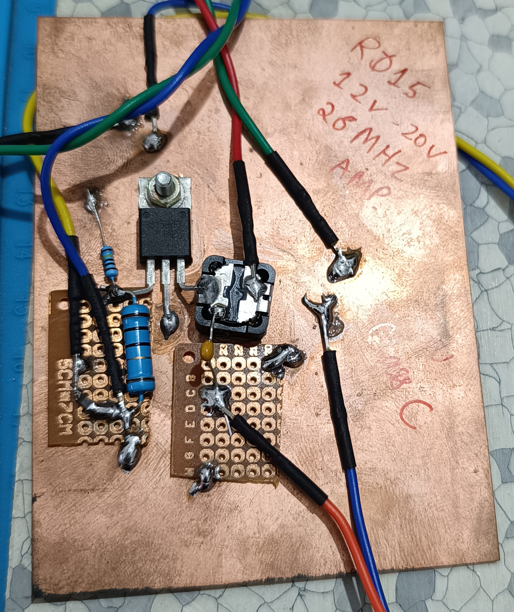
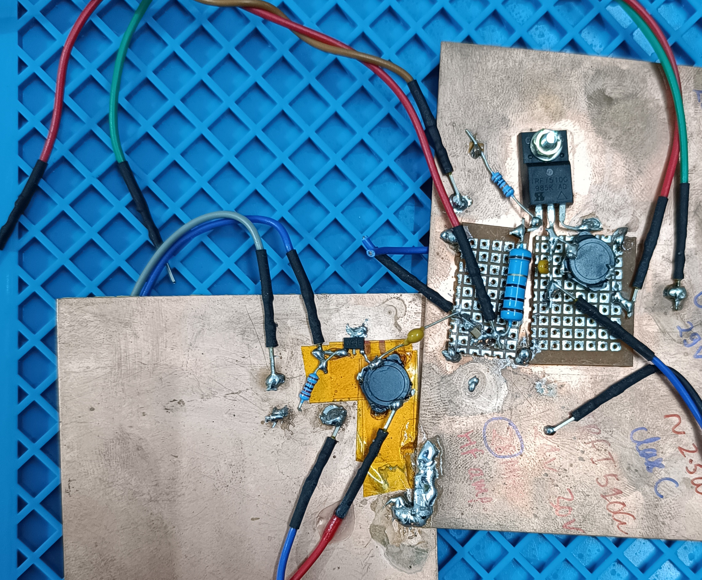
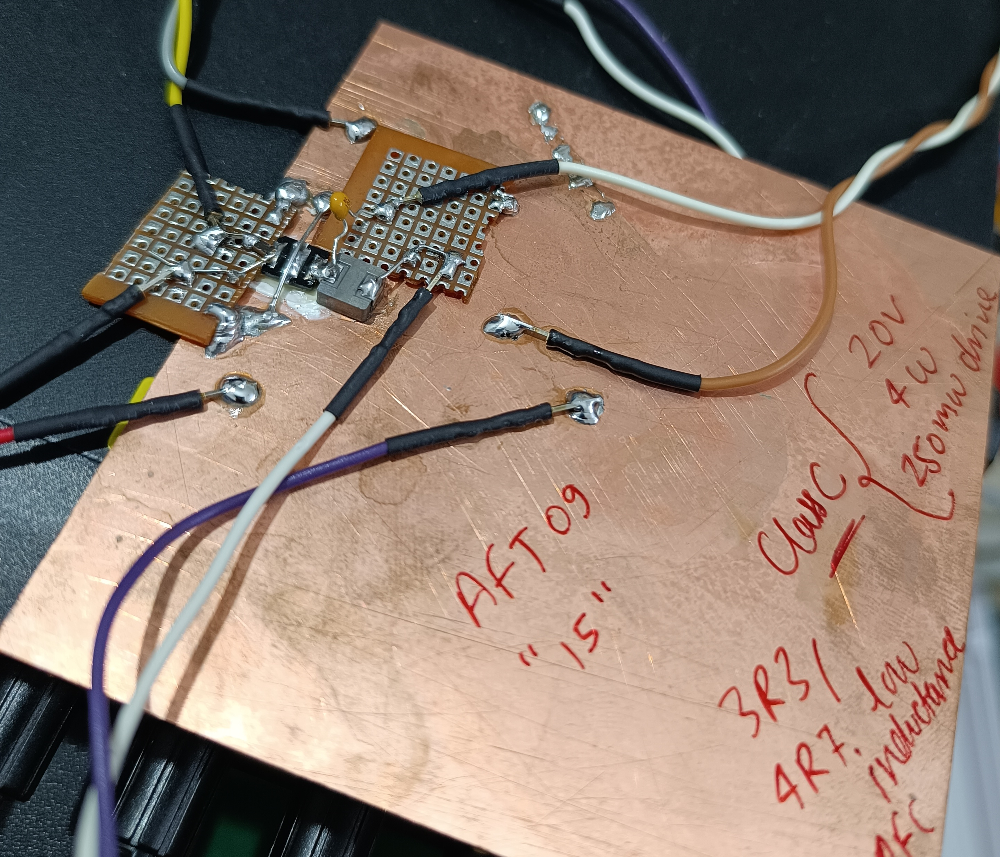
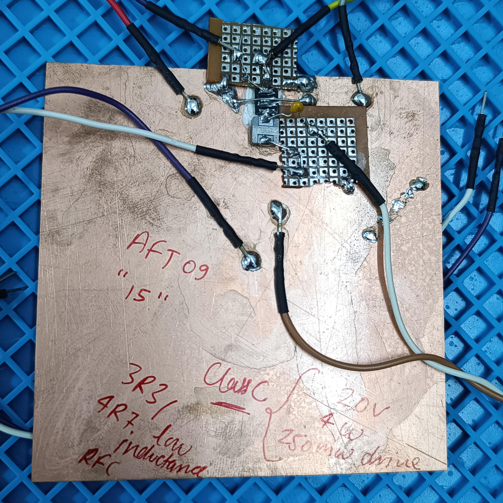
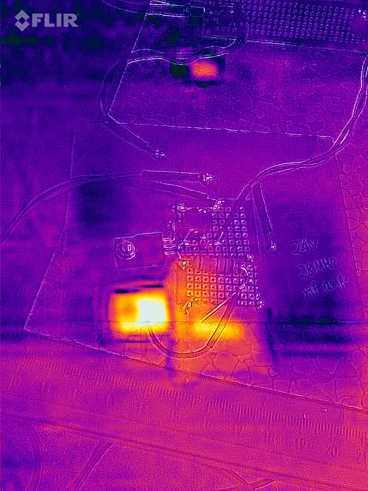


#### Results

October-2022 UPDATE: The PCB manufactured by JLCPCB was successfully validated.
We could get 5W+ with IRF510 @ 20v drain @ 28 MHz. Output at 14 MHz can be more
than 10W easily too.

PCB bug (in `HF-PA-Combined` version): Please cut the positive trace going
between C15 and JP2 to enable dynamic PA voltage control using PTT. This bug
is fixed in `HF-PA-Combined-v2` version for future production.

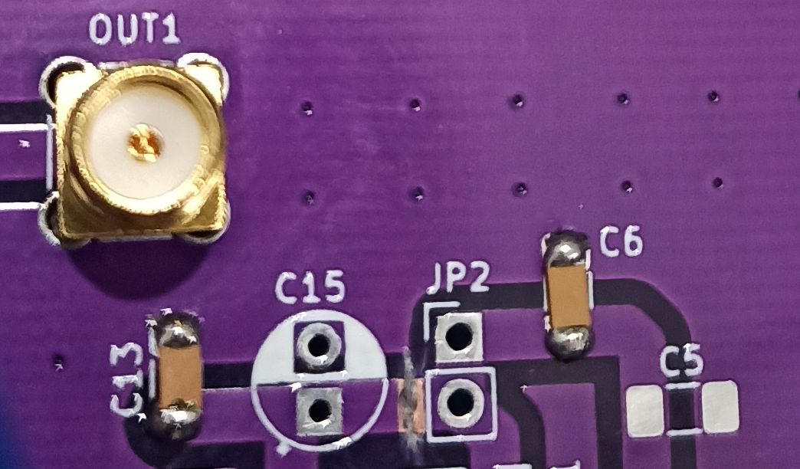

NOTE: See https://github.com/kholia/HF-PA-v6/tree/master/HF-PA-Combined for the
schematics, design files, and a PCB render screenshot.

IRF510 @ 14 MHz -> 20v @ drain. RF output > 7.5W. No LPF. Clean'ish looking
output. No oscillations. BS170 @ 5.5v. DC bias set high for max'ish "Idq".

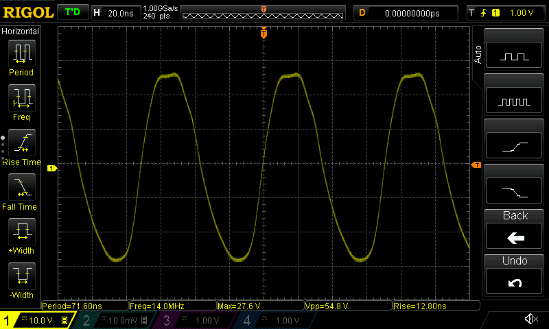

IRF510 @ 21 MHz -> 15v @ drain. 12.75W DC input. RF output > 3W. No LPF.
Clean'ish looking output. No oscillations. BS170 @ 5.5v. DC bias set high for
max'ish "Idq". Almost 4W can be achieved with max "Idq".


IRF510 @ 28 MHz -> 14v @ drain. 9W DC input. RF output > 2W (on meter). No LPF.
Clean'ish looking output. No oscillations. BS170 @ 5.5v. DC bias set high for
max'ish "Idq".

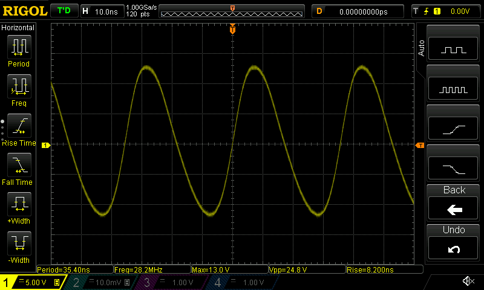

IRF510 @ 28 MHz -> 17v @ drain. RF output > 2.25W (on scope), 3.5W on RF power
meter. No LPF. Clean'ish looking output. No oscillations. BS170 @ 6v. DC bias
set high for max "Idq" @ 4.2v roughly.

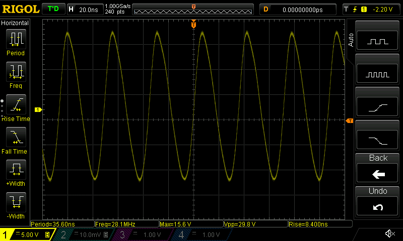

Note: We can even use 30v (and higher+) drain voltages (PA voltages) with
IRF510 - with much more care though!


Even 3W can get worldwide DX contacts when propagation is playing along ;)

7W (or less) of HF RF power offers global communications coverage when
propagation is good:


#### BOM Notes

See https://github.com/kholia/HF-PA-v5 for the BOM and BOM sources.

- https://github.com/kholia/HF-PA-v5#pa-bom

- https://github.com/kholia/HF-PA-v5#bom--equipment-sources


#### Build Notes

L1 can be a simple choke (FT37-43 25 turns of 27 to 29 SWG wire).

L2 needs to be a bifilar transformer on FT50-43 core (10 turns with 24/25/26
SWG wire).


#### Notes

[BS170 Driver Performance](./BS170-Driver-Performance.txt)

As Vds is increased, the Vgs needs to be increased too - see the following
graph.

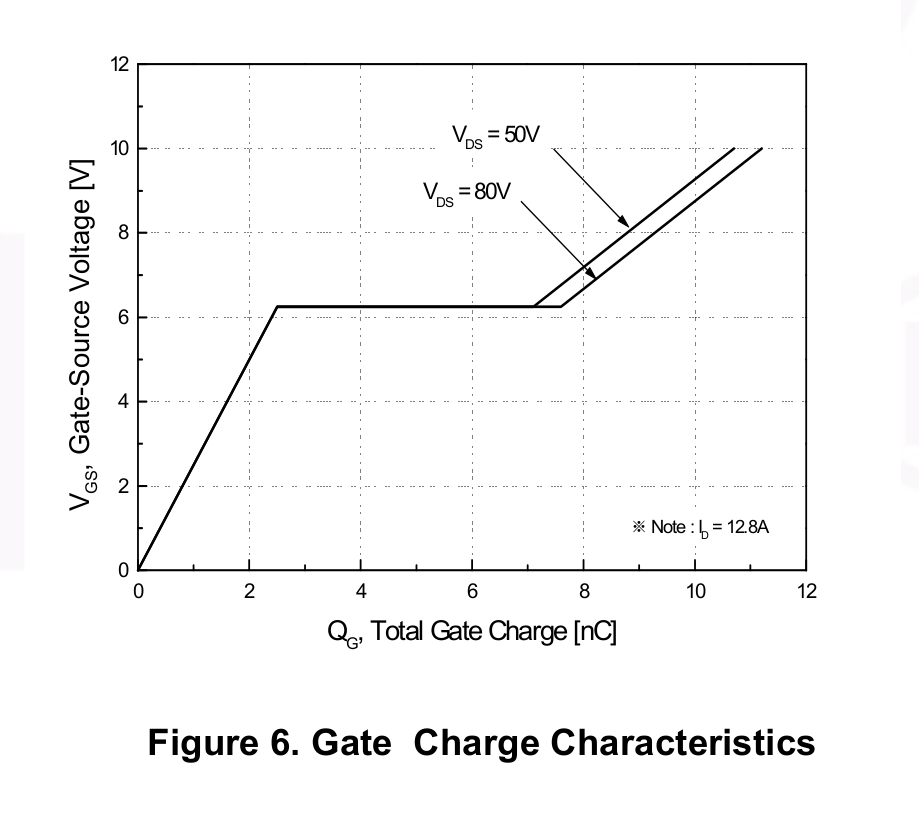

If the gate DC bias is too less, the MOSFET will not turn on properly, and will
generate a lot of distortion - one prominent distorted waveform will be at
half-the-operating frequency!

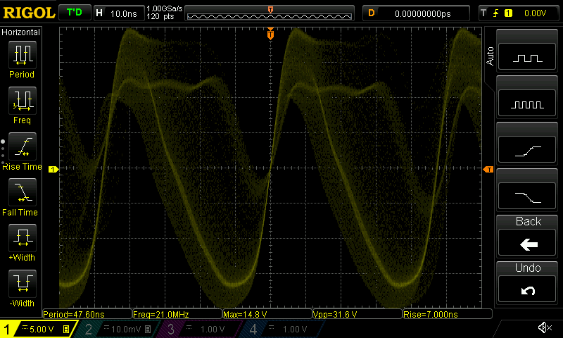

When operating at max "Idq" (for best linearity), the power to the IRF510
should be PTT controlled - otherwise too much (battery) power will turn to heat
instead of RF!


#### Special Notes

While IRF510 can get destroyed due to oscillations, in my case it has been a
failed 7805 (or 78L05) regulator which ultimately causes cascading failures.

A 7805 regulator can fail in fail-short mode, where `Vout == Vin`! This changes
the bias of the driver stage (BS170), and it goes in full conduction
immediately without any RF input because Vgs(th) is exceeded quite easily.
This causes further failures in the PA system!

My 7805s (and 78L05s) of dubious origin were failing (Vout shorted to Vin!)
around 20v to 24v. Here is what `bd139` (from https://www.eevblog.com/forum/)
has to say on this topic,

```
None of the voltage regulators work properly above about 20V if you want 5V
out. If you need to drop more, add a preregulator.

I found this out the hard way as well dropping 28V to 5V DC for logic in an RF
PA driver. Currently waiting for a board spin. I only needed 50mA and didn't
want RF noise so I went with a simple MOSFET/zener/resistor preregulator to
drop it down to 18Vish. Because the current requirements are relatively low I
don't need to heatsink either then as the load is spread evenly across both
MOSFET and 7805.

Also if you value the circuit it's driving, stick a 5W 5.6V zener across the
regulator output. That will smoke the prereg / regulator not the load!
```

Thank you `bd139`!


#### PCB Renderings

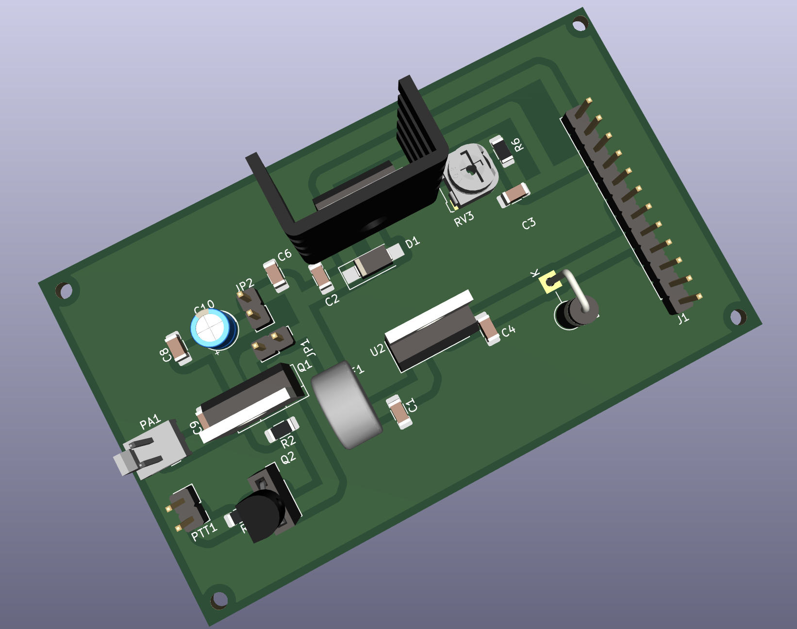

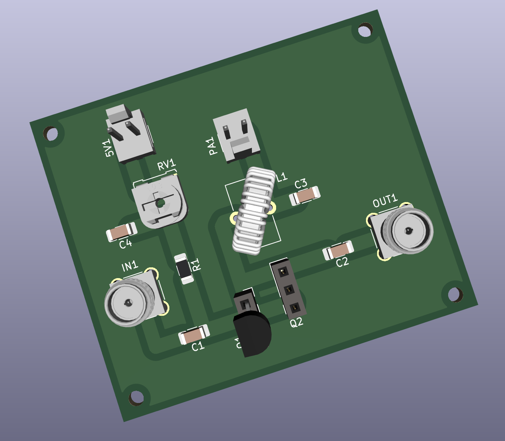

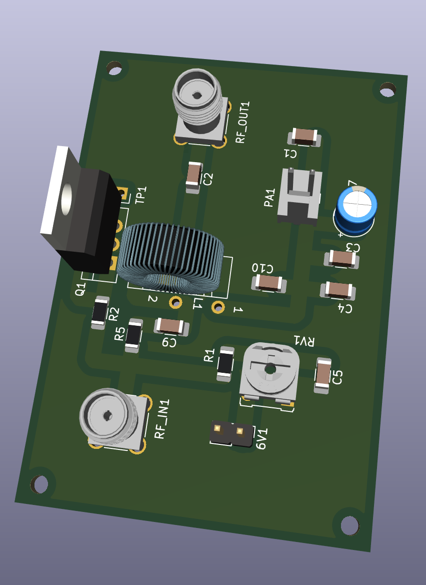

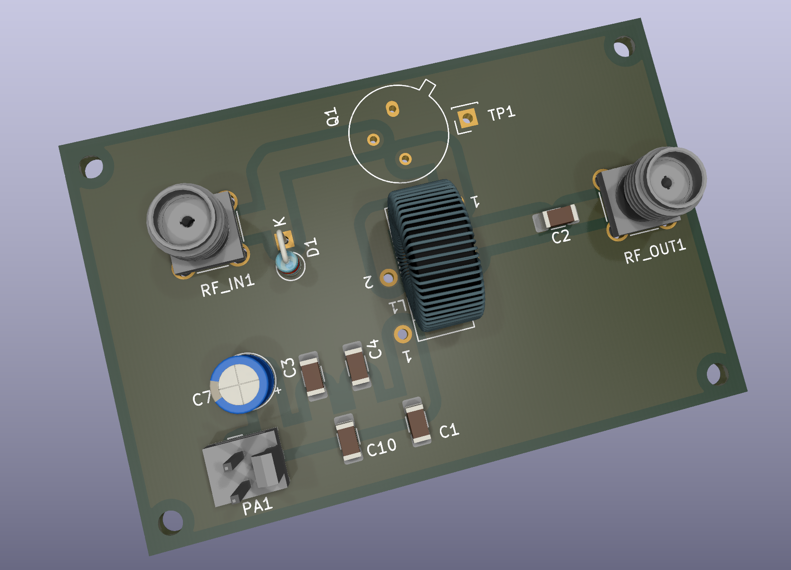


#### Joining In

Are you interested in such projects, and spam-free technical discussions?

If yes, you might be interested in joining [the 'HAMBREWERS' Telegram group](https://t.me/+TwzGyKGe8_QI_B3y).
